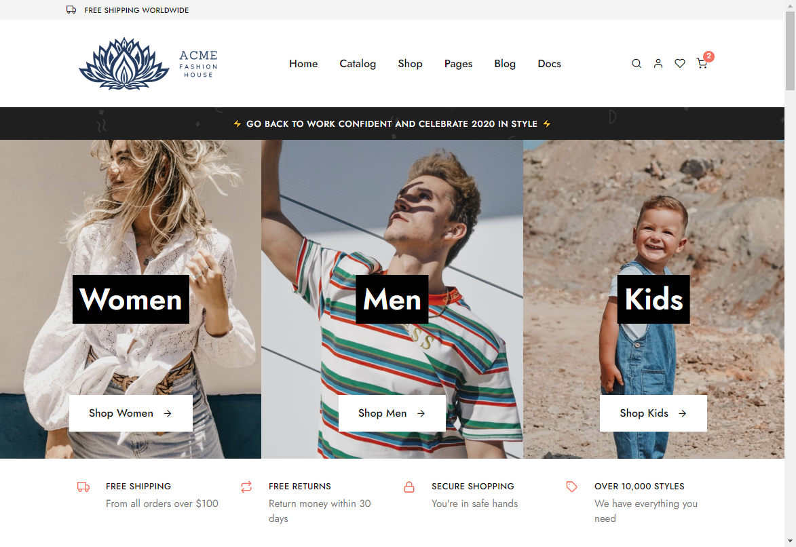

# ACME Fashion House
Welcome to the ACME fashion house demo website! This is the demo website for the **[Introduction to Web Accessibility WCAG 2.1](https://www.udemy.com/course/introduction-to-web-accessibility-wcag21/?referralCode=05B73E4177FADAD9930A)** Udemy course.

The ACME fashion house website has several accessibility errors. In this workshop we will fix each issue and explain the outcome.

## Getting Started
Go ahead and clone or download this repo to your machine, then dive in and get started!

### Installing
* [Colour Contrast Analyser (Windows and Mac)](https://developer.paciellogroup.com/resources/contrastanalyser/)
* [Google Chrome](https://www.google.com/chrome/)
* [Microsoft Edge](https://www.microsoft.com/en-us/edge)
* [Notepad++](https://notepad-plus-plus.org/downloads/)

## Modules

| Module | Topic |
| --- | --- |
| Module 1 | [Building The Structure of the Page](1-build-structure-of-page/README.md)
| Module 2 | [Adding Page Level Content](2-add-pagelevel-content/README.md)
| Module 3 | [Improving The Structure Of A Webform](3-improve-structure-of-webform/README.md)

